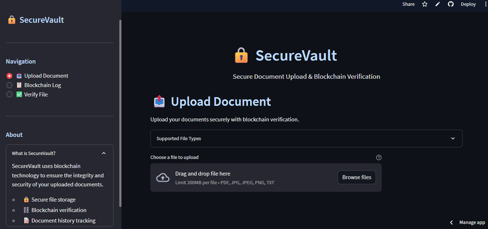
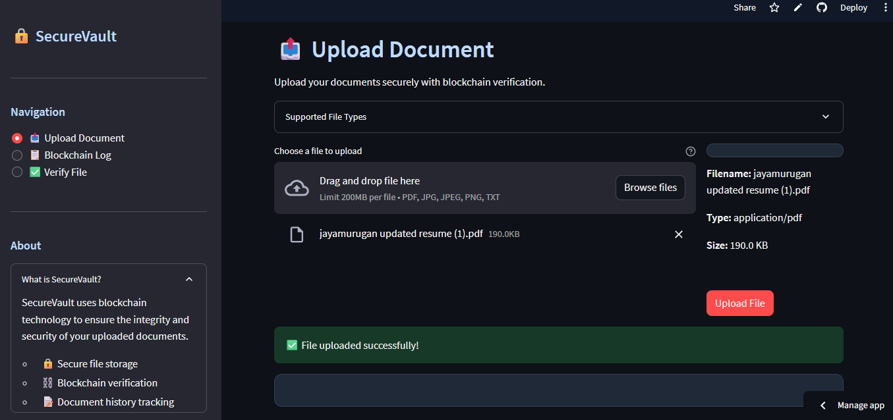
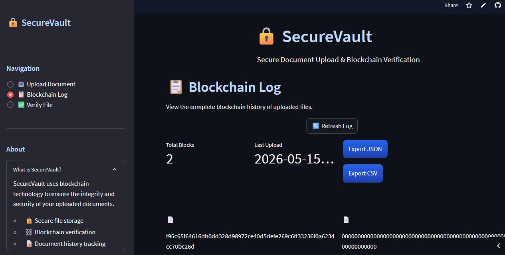
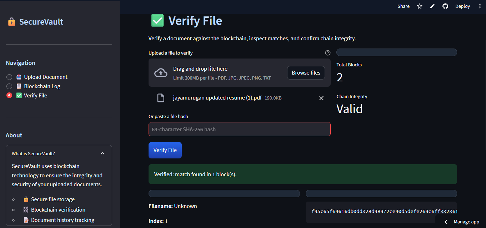
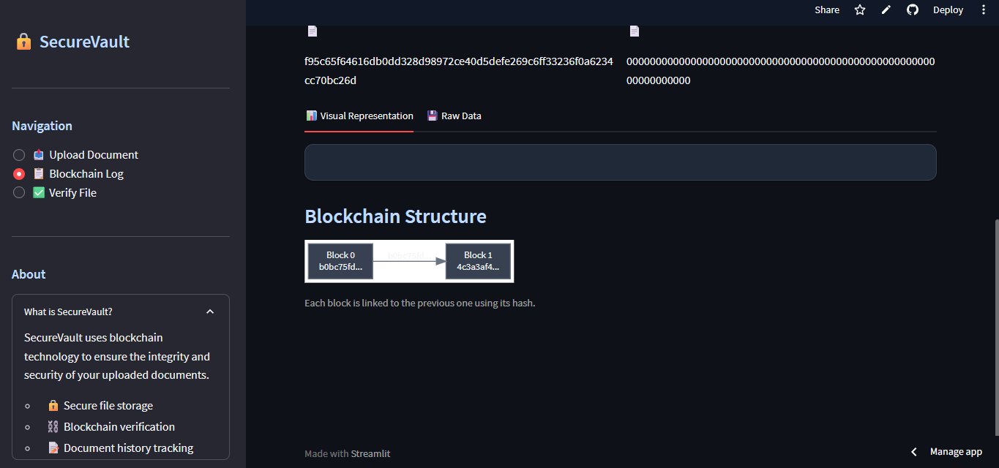
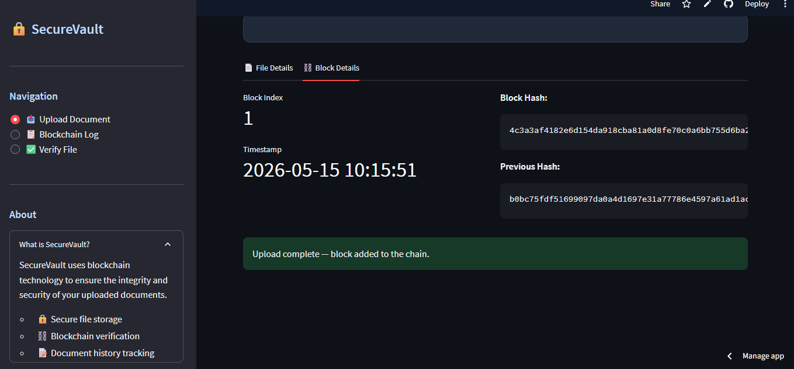

# SecureVault

<p align="center">
  
</p>

<p align="center">
  <a href="https://www.python.org/">
    
  </a>
  <a href="https://streamlit.io/">
    
  </a>
  <a href="https://fastapi.tiangolo.com/">
    
  </a>
  <a href="LICENSE">
    
  </a>
</p>

<p align="center">
  SecureVault is a polished file upload and blockchain-verification app built with a Streamlit frontend and a FastAPI backend.
  It hashes uploaded files, records them in a blockchain-style ledger, and lets you review the audit trail in a clean UI.
</p>

---

## Highlights

- 🔐 Secure document upload with hash-based verification
- ⛓️ Blockchain-style audit log for uploaded files
- 📊 Recent uploads, export options, and verification tools
- 🖼️ Image previews and cleaner responsive layouts
- ⚡ FastAPI backend + Streamlit frontend

---

## Screenshots

### 🏠 Home Page

<p align="center">
  
</p>

### 📤 Upload Document

<p align="center">
  
</p>

### 📋 Blockchain Log

<p align="center">
  
</p>

### ✅ Verify File

<p align="center">
  
</p>

### ⛓️ Blockchain Structure

<p align="center">
  
</p>

### ➕ Add Block Details

<p align="center">
  
</p>

---

## Pages & Features

- **📤 Upload Document** — upload files, preview images, and secure documents
- **📋 Blockchain Log** — view recent uploads, export data (JSON/CSV), and inspect the ledger
- **✅ Verify File** — verify a file or hash and check blockchain chain integrity
- **📊 Blockchain Visualization** — see the hash chain structure in real time
- **🔄 Real-time Updates** — refresh logs and track new uploads instantly

---

## Tech Stack

- **Frontend:** Streamlit
- **Backend:** FastAPI
- **Language:** Python
- **Data:** Pandas
- **Graph:** Graphviz
- **HTTP:** `requests`

---

## Quick Start

### Local with virtualenv

```bash
python -m venv .venv
.venv/bin/pip install -r requirements.txt
```

Start the backend:

```bash
.venv/bin/python -m uvicorn main:app --host 0.0.0.0 --port 8000
```

In another terminal, start the UI:

```bash
.venv/bin/streamlit run app.py
```

### Docker

```bash
docker-compose up --build
```

- Backend: http://localhost:8000
- UI: http://localhost:8501

---

## Configuration

Environment variables you may want to set:

- `DATABASE_URL` — SQLAlchemy database URL
- `CORS_ALLOW_ORIGINS` — allowed frontend origins
- `BACKEND_URL` — backend URL used by the Streamlit UI

Example local defaults:

- `DATABASE_URL=sqlite:///./securevault.db`
- `CORS_ALLOW_ORIGINS=http://localhost:8501`
- `BACKEND_URL=http://localhost:8000`

---

## Project Structure

```text
securevault/
├── app.py
├── main.py
├── ui_components.py
├── utils.py
├── requirements.txt
├── docker-compose.yml
├── Dockerfile.backend
├── Dockerfile.frontend
├── render.yaml
├── test_upload.py
└── uploads/
```

---

## Usage

1. Open `📤 Upload Document` and upload a file.
2. Switch to `📋 Blockchain Log` to see the latest blocks and export data.
3. Open `✅ Verify File` to confirm a file or hash is recorded on-chain.

---

## Deployment Notes

- Use `Dockerfile.backend` for the FastAPI service.
- Use `Dockerfile.frontend` or Streamlit Cloud for the UI.
- Point `BACKEND_URL` to your deployed backend.

---

## Author

**DINESH S**

---

## License

This project is licensed under the MIT License. See [LICENSE](LICENSE) for details.

---

<p align="center">
  Made with care for secure, verifiable document workflows.
</p>
